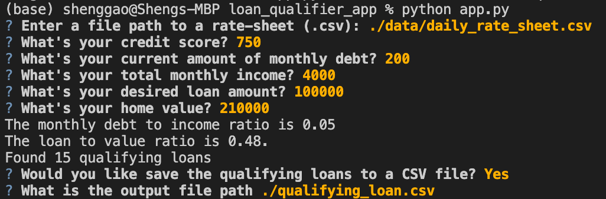
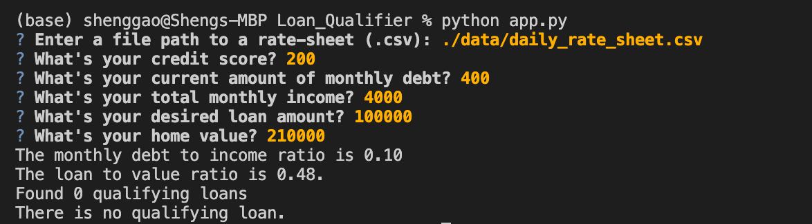
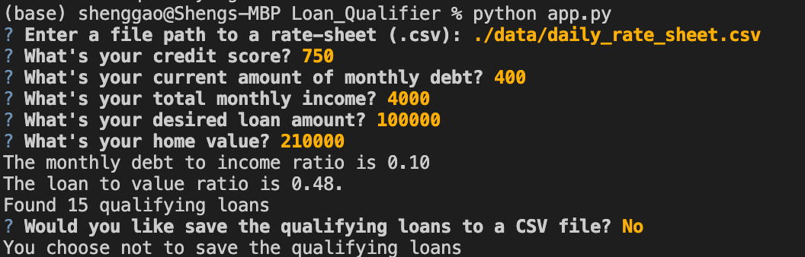

# Loan Qualifier Application CLI

This is a python command-line interface application that allows users to see qualifying loans from lenders quickly and easily. The application works by taking in a `daily_rate_sheet` of loan criteria from various loan providers, asking the user a number of questions to evaluate their loan eligibility, and then returning to them a list of qualifying loans. After finding the qualifying banks, the customer can choose whether they want to save the results as a CSV file.

---

## Technologies

This project leverages python 3.7 with the following packages:

* [fire](https://github.com/google/python-fire) - For the command line interface, help page, and entry-point.

* [questionary](https://github.com/tmbo/questionary) - For interactive user prompts and dialogs

---

## Installation Guide

Before running the application first install the following dependencies.

```python
  pip install fire
  pip install questionary
```

---

## Usage

To use the loan qualifier application simply clone the repository and run the **app.py** with:

```python
python app.py
```

Upon launching the loan qualifier application you will be greeted with the following prompts.





---

## Contributors

Sheng Gao
sheng_gao@outlook.com

---

## License

Columbia Engineering FinTech Boot Camp
